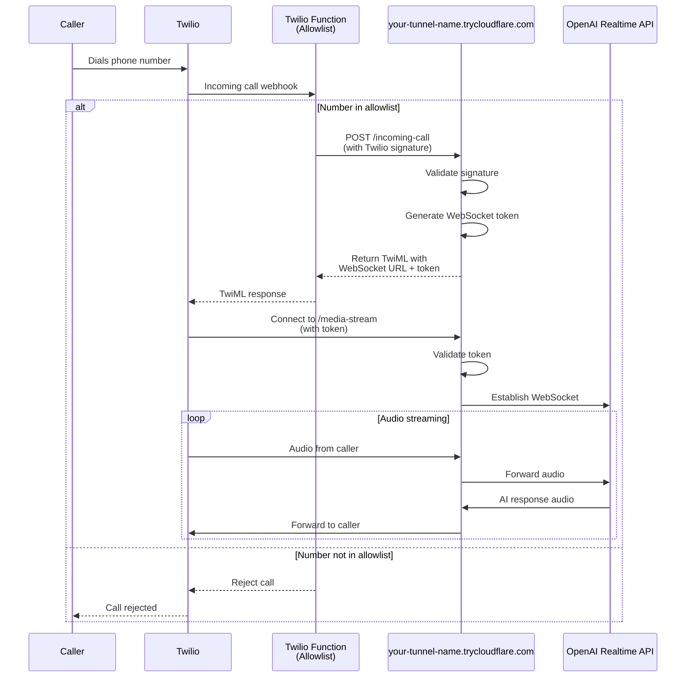

# Voice Assistant

Personal voice assistant using Twilio Voice and OpenAI's Realtime API for phone-based AI conversations.

## Architecture



## Security

This application uses **three layers of security** to protect against unauthorized access:

### Layer 1: Phone Number Allowlist (Twilio Function)
- Runs on Twilio's infrastructure before reaching your server
- Only approved phone numbers can proceed
- See `twilio/allowlist-function.js` for implementation

### Layer 2: Twilio Signature Validation
- Validates all webhook requests from Twilio
- Ensures requests are authentic and haven't been tampered with
- Uses HMAC-SHA1 with your `TWILIO_AUTH_TOKEN`

### Layer 3: WebSocket Token Authentication
- Single-use tokens generated for each call
- 60-second expiration window
- Prevents unauthorized WebSocket connections

## Prerequisites

- Python 3.13+
- [uv](https://docs.astral.sh/uv/) for dependency management
- Twilio account with a voice-capable phone number
- OpenAI API key with Realtime API access
- cloudflared for local development tunneling

## Setup

### 1. Configure environment

```bash
cp .env.example .env
```

Edit `.env` and configure:
- `OPENAI_API_KEY` - Your OpenAI API key
- `TWILIO_AUTH_TOKEN` - Your Twilio Auth Token (found in [Twilio Console](https://console.twilio.com/))
- `SYSTEM_MESSAGE` - AI assistant behavior instructions
- `VOICE` - OpenAI voice name (e.g., `alloy`, `shimmer`, `nova`)
- `PORT` - Server port (default: 5050)
- `TEMPERATURE` - AI temperature (default: 0.8)

Note: `WEBHOOK_URL` and `ALLOWED_NUMBERS` are only used in the Twilio Function (see Layer 1 security below), not in your local application.

### 2. Start cloudflared tunnel

**Option A: Quick temporary tunnel** (random URL):
```bash
make tunnel-quick
```
Copy the forwarding URL (e.g., `https://xyz.trycloudflare.com`).

**Option B: Named tunnel with stable domain** (one-time setup):
```bash
# 1. Authenticate with Cloudflare
cloudflared tunnel login

# 2. Create a named tunnel
cloudflared tunnel create assistant

# 3. Route a DNS hostname (replace with your domain)
cloudflared tunnel route dns assistant assistant.yourdomain.com

# 4. Create ~/.cloudflared/assistant.yml with your tunnel ID and domain

# 5. Run the tunnel
make tunnel
```

### 3. Deploy Twilio Allowlist Function

**Create the Function:**
1. In [Twilio Console](https://console.twilio.com/), go to **Functions & Assets** > **Services**
2. Create a new Service (e.g., "voice-assistant-auth")
3. Add a new Function with path `/incoming-call`
4. Copy the code from `twilio/allowlist-function.js`
5. In **Environment Variables**, add:
   - `ALLOWED_NUMBERS` - Comma-separated phone numbers (e.g., `+15551234567,+15559876543`)
   - `WEBHOOK_URL` - Your assistant URL (e.g., `https://your-tunnel-name.trycloudflare.com/incoming-call`)
6. Deploy the service

**Configure Your Phone Number:**
1. Navigate to **Phone Numbers** > **Manage** > **Active Numbers**
2. Select your number
3. Set **A call comes in** to **Function**: Select your deployed function
4. Save

## Run

```bash
uv run python main.py
```

Call your Twilio number to talk with the assistant.

## Features

- Real-time voice conversation with OpenAI
- Natural interrupt handling and AI preemption
- Bidirectional audio streaming between Twilio and OpenAI

