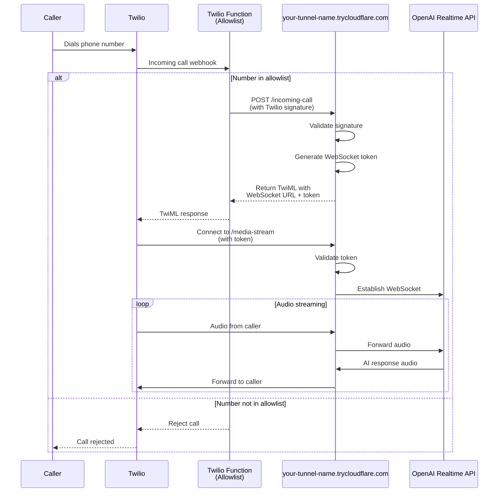

# Voice Assistant

Personal voice assistant using Twilio Voice and OpenAI's Realtime API for phone-based AI conversations.

## Architecture



## Security

This application uses **three layers of security** to protect against unauthorized access:

### Layer 1: Phone Number Allowlist (Twilio Function)
- Runs on Twilio's infrastructure before reaching your server
- Only approved phone numbers can proceed
- See `twilio/allowlist-function.js` for implementation

### Layer 2: Twilio Signature Validation
- Validates all webhook requests from Twilio
- Ensures requests are authentic and haven't been tampered with
- Uses HMAC-SHA1 with your `TWILIO_AUTH_TOKEN`

### Layer 3: WebSocket Token Authentication
- Single-use tokens generated for each call
- 60-second expiration window
- Prevents unauthorized WebSocket connections

## Prerequisites

- Python 3.13+
- [uv](https://docs.astral.sh/uv/) for dependency management
- Twilio account with a voice-capable phone number
- OpenAI API key with Realtime API access
- cloudflared for local development tunneling
- Docker (optional, for containerized deployment)
- [Fly.io account](https://fly.io) (optional, for production deployment)

## Setup

### 1. Configure environment

```bash
cp .env.example .env
```

Edit `.env` and configure:
- `OPENAI_API_KEY` - Your OpenAI API key
- `TWILIO_AUTH_TOKEN` - Your Twilio Auth Token (found in [Twilio Console](https://console.twilio.com/))
- `ZAPIER_MCP_URL` - Zapier MCP server URL (default: `https://mcp.zapier.com/api/mcp/mcp`)
- `ZAPIER_MCP_PASSWORD` - Zapier API key in base64 format (get from [Zapier MCP Developer](https://zapier.com/app/developer/mcp))
- `ASSISTANT_INSTRUCTIONS` - AI assistant personality, behavior, and tool usage instructions
- `VOICE` - OpenAI voice name (e.g., `alloy`, `shimmer`, `nova`)
- `PORT` - Server port (default: 5050)
- `TEMPERATURE` - AI temperature (default: 0.8)

Note: `WEBHOOK_URL` and `ALLOWED_NUMBERS` are only used in the Twilio Function (see Layer 1 security below), not in your local application.

### 2. Start cloudflared tunnel

**Option A: Quick temporary tunnel** (random URL):
```bash
make tunnel-quick
```
Copy the forwarding URL (e.g., `https://xyz.trycloudflare.com`).

**Option B: Named tunnel with stable domain** (one-time setup):
```bash
# 1. Authenticate with Cloudflare
cloudflared tunnel login

# 2. Create a named tunnel
cloudflared tunnel create assistant

# 3. Route a DNS hostname (replace with your domain)
cloudflared tunnel route dns assistant assistant.yourdomain.com

# 4. Create ~/.cloudflared/assistant.yml with your tunnel ID and domain

# 5. Run the tunnel
make tunnel
```

### 3. Deploy Twilio Allowlist Function

**Create the Function:**
1. In [Twilio Console](https://console.twilio.com/), go to **Functions & Assets** > **Services**
2. Create a new Service (e.g., "voice-assistant-auth")
3. Add a new Function with path `/incoming-call`
4. Copy the code from `twilio/allowlist-function.js`
5. In **Environment Variables**, add:
   - `ALLOWED_NUMBERS` - Comma-separated phone numbers (e.g., `+15551234567,+15559876543`)
   - `WEBHOOK_URL` - Your assistant URL (e.g., `https://your-tunnel-name.trycloudflare.com/incoming-call`)
6. Deploy the service

**Configure Your Phone Number:**
1. Navigate to **Phone Numbers** > **Manage** > **Active Numbers**
2. Select your number
3. Set **A call comes in** to **Function**: Select your deployed function
4. Save

## Run

### Local Development

```bash
uv run python main.py
```

Call your Twilio number to talk with the assistant.

## Deployment

### Docker

**Build and run locally:**
```bash
docker compose up
```

**Run with cloudflared tunnel (dev profile):**
```bash
docker compose --profile dev up
```

### Fly.io

**Initial setup:**
```bash
# Install flyctl
brew install flyctl

# Authenticate
fly auth login

# Launch app (generates fly.toml and creates app, but doesn't deploy)
fly launch --no-deploy
```

**Configure environment:**

Set secrets:
```bash
fly secrets set OPENAI_API_KEY=your_key_here
fly secrets set TWILIO_AUTH_TOKEN=your_token_here
fly secrets set ZAPIER_MCP_PASSWORD=your_zapier_api_key_base64
```

Non-secret environment variables (VOICE, TEMPERATURE, ASSISTANT_INSTRUCTIONS, ZAPIER_MCP_URL) are configured in `fly.toml`.

**Deploy:**
```bash
fly deploy
```

**Get your app URL:**
```bash
fly status
```

Your webhook URL will be: `https://[your-app-name].fly.dev/incoming-call`

Use this URL as your `WEBHOOK_URL` in the Twilio Function.

**Scale to single machine (optional):**
```bash
fly scale count 1 -y
```

**Custom domain setup (optional):**

1. Get your Fly IP addresses:
```bash
fly ips list
```

2. In your DNS provider (e.g., Cloudflare), add DNS records for your custom domain:
   - **A record**: Point to the IPv4 address shown in `fly ips list`
   - **AAAA record**: Point to the IPv6 address shown in `fly ips list`

3. Add the custom domain to Fly (triggers Let's Encrypt certificate):
```bash
fly certs add your-domain.com
```

4. Check certificate status:
```bash
fly certs show your-domain.com
```

5. Once issued, update your Twilio Function's `WEBHOOK_URL` to use your custom domain:
   - Example: `https://your-domain.com/incoming-call`

**View logs:**
```bash
fly logs
```

## MCP Integration (Zapier)

This assistant integrates with Zapier's MCP server, which connects to multiple services:
- **Todoist**: Task management and reminders
- **Gmail**: Email search

### Setup

1. **Get Zapier MCP API Key:**
   - Go to [Zapier MCP Developer](https://zapier.com/app/developer/mcp)
   - Generate an API key
   - Set secret as `ZAPIER_MCP_PASSWORD`

2. **Configure in `.env`:**
   ```bash
   ZAPIER_MCP_URL=https://mcp.zapier.com/api/mcp/mcp
   ZAPIER_MCP_PASSWORD=your_zapier_api_key_base64
   ```

3. **The MCP configuration is set in `main.py`:**
   ```python
   {
       "type": "mcp",
       "server_label": "zapier",
       "server_url": ZAPIER_MCP_URL,
       "headers": {
           "Authorization": f"Bearer {ZAPIER_MCP_PASSWORD}"
       },
       "require_approval": "never"
   }
   ```

### Available Voice Commands

Once configured, you can use natural language for:

**Todoist Tasks:**
- "Add buy milk to my todo list"
- "What tasks do I have today?"
- "Mark task as complete"
- "What's due tomorrow?"

**Gmail Search:**
- "Search my email for messages about project updates"
- "Find emails from John sent this week"

### Todoist API Tips

When fetching today's tasks, the assistant uses the Todoist API with the `filter=today` parameter:
```
GET https://api.todoist.com/rest/v2/tasks?filter=today
```

This ensures accurate results when users ask "what do I have to do today?" or similar queries.

## Features

- Real-time voice conversation with OpenAI
- Natural interrupt handling and AI preemption
- Bidirectional audio streaming between Twilio and OpenAI
- Task management via Zapier MCP (Todoist integration)
- Email search via Zapier MCP (Gmail integration)
